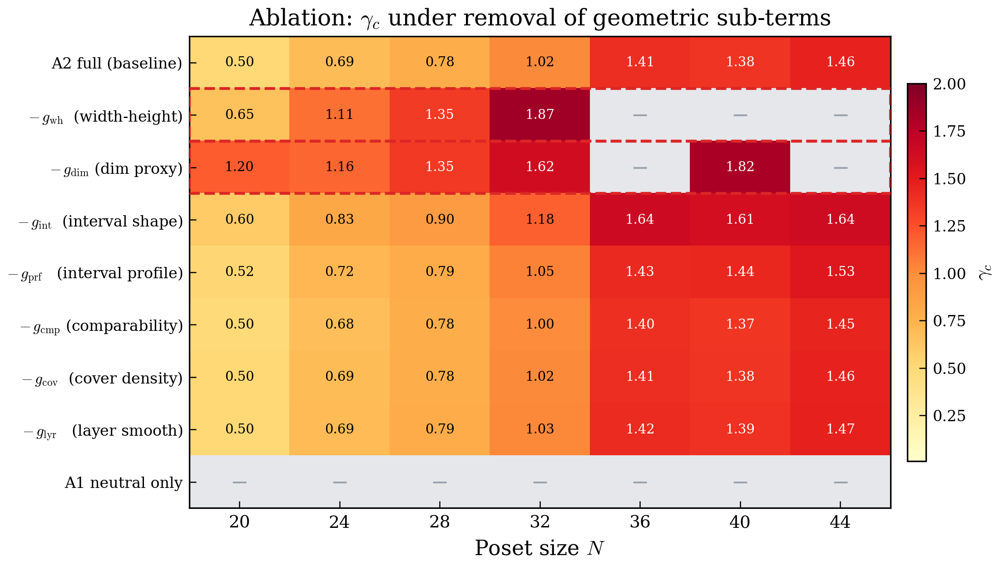
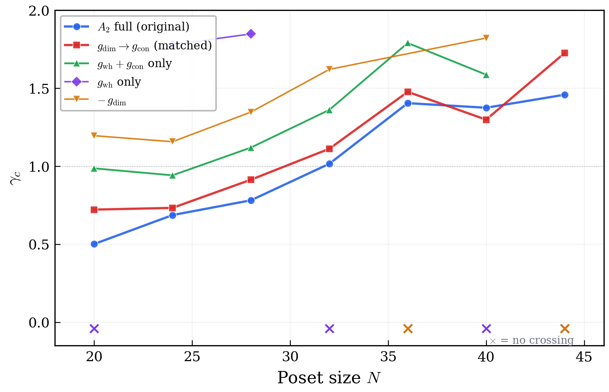

# Bounded Geometric Phase Transition in Finite Causal Posets with Exact Entropy

---

## Abstract

The Kleitman–Rothschild (KR) theorem implies that generic finite posets are 3-layered and maximally entropic, posing a fundamental obstacle to geometric phase emergence in discrete causal models. We construct a 7-family poset ensemble and compute exact linear extension counts for N = 10–44 elements to study action-weighted competition between Lorentzian-like geometric structures and KR-type high-entropy posets. Under a decomposable action combining neutral and geometric penalty terms, we find that the critical geometric coupling γ_c remains O(1) across all tested sizes — the first finite-size evidence of a bounded phase transition threshold in this setting. Systematic ablation of seven geometric sub-terms identifies a minimal backbone of two constraints: global layer-shape balance and dimensional scale consistency. Crucially, the latter can be replaced by a non-target-anchored variant (penalizing local–global dimension inconsistency rather than deviation from a specific d = 2 target), with γ_c preserved at the same order of magnitude. These results provide finite-size evidence that Lorentzian-like order in discrete causal structures can emerge from structural self-consistency constraints, without requiring dimension-specific priors.

---

## 1. Introduction

The hypothesis that spacetime is fundamentally discrete — a locally finite partial order (poset) whose elements are causally related events — lies at the heart of causal set theory (CST) [1, 2]. A central challenge for this program is the *entropy catastrophe*: the Kleitman–Rothschild (KR) theorem [3] establishes that, asymptotically, almost all labeled finite posets consist of three layers with bipartite random connectivity and maximal linear extension count. If one weights posets by the pure combinatorial entropy H = log(number of linear extensions), the partition function is overwhelmingly dominated by these non-geometric, KR-type structures. Geometric order — the kind of layered, causally propagating structure that would correspond to a Lorentzian manifold under coarse-graining — occupies an exponentially small fraction of the configuration space.

Several strategies have been proposed to address this. Carlip [4] argued that midpoint-scaling properties of causal intervals can suppress KR dominance, shifting the effective measure toward geometric posets. Surya [5] developed a formal CST partition function framework. Loomis and Carlip [6] performed 2D causal set simulations using Markov chain Monte Carlo. However, no prior work has demonstrated an explicit, finite-size phase transition threshold γ_c that separates a KR-dominated phase from a geometrically competitive phase, computed with exact (non-approximate) entropy across a wide range of poset sizes.

In this work, we take a direct numerical approach. We construct an ensemble of seven structurally distinct poset families, compute exact linear extension counts using dynamic programming for N up to 44, and define a decomposable action with separately controllable neutral and geometric penalty terms. Our main finding is that the critical coupling γ_c for Lorentzian-like 2D posets to overtake KR posets remains bounded and O(1) across all tested sizes.

To address the natural concern that this result might be circular — that geometric penalties simply "reward looking geometric" — we perform a systematic ablation study. We identify which of seven geometric sub-terms are necessary for the phase transition and which are dispensable. The two critical drivers are (i) a global layer-shape constraint that penalizes degenerate causal chain depth, and (ii) a dimensional proxy. We then replace the latter with a *non-target-anchored* alternative that penalizes local–global dimension inconsistency without specifying any target dimension. The phase transition survives this replacement, establishing that the mechanism does not require a dimension-specific prior.

---

## 2. Framework

### 2.1 Poset Ensemble

We consider finite posets P = (V, ≤) with |V| = N elements. Each poset is represented by its transitive reduction (Hasse diagram). We generate samples from seven structurally distinct families:

- **Lorentzian-like 2D** (`lor2d`): Layered posets mimicking 2D causal diamond structure, with layer sizes following a diamond profile and inter-layer edges determined by spatial proximity.
- **Lorentzian-like 3D** (`lor3d`): Three-dimensional analogue with broader layers and correspondingly lower comparable fraction.
- **KR-like** (`kr`): Three-layer bipartite posets with random inter-layer edges, approximating the KR structure that dominates the entropy landscape.
- **Multi-layer random** (`mlr`): Random layered posets with uniformly drawn layer count and random inter-layer connectivity.
- **Transitive percolation** (`tp`): Posets generated by transitive closure of a random DAG on a totally ordered set with independent edge probability.
- **Interval order** (`int`): Posets arising from random intervals on the real line, where x < y iff the interval of x lies entirely below that of y.
- **Absolute layered** (`abs`): Fully connected layered posets with all inter-layer edges present.

For each family and each N ∈ {10, 12, 14, 16, 20, 24, 28, 32, 36, 40, 44}, we generate K = 5 independent samples. We distinguish two sample sets: a **confirmatory mainline** (used in Section 3.1 for the primary γ_c curve) and an independent **exploratory set** (used in Sections 3.2–3.3 for ablation and replacement studies). Both sets use the same generators and parameters; they differ only in random seeds. The A2 baseline γ_c values are O(1) in both sets, ensuring that qualitative conclusions are robust to sample variation.

### 2.2 Exact Linear Extension Count

The entropy of a poset P is defined as H(P) = log |L(P)|, where L(P) is the set of linear extensions (topological sorts). We compute |L(P)| exactly using dynamic programming over antichains [7]. The state space is the set of all antichains of the poset (equivalently characterized as maximal antichains of the remaining down-set); transitions correspond to removing a minimal element.

A key structural observation is that the computational cost of this algorithm depends strongly on the poset's antichain structure. For `lor2d`, whose antichain width grows slowly with N, exact computation remains sub-second to N = 48. For `kr`, whose middle layer is O(N), the cost grows dramatically and becomes impractical beyond N ≈ 50. This asymmetry is a structural fact about the posets, not an algorithmic artifact.

| N | lor2d time | kr time |
|---|---|---|
| 30 | 0.02 s | 0.31 s |
| 40 | 0.07 s | 14.3 s |
| 44 | 0.09 s | 54.0 s |

### 2.3 Action Definition

We define three action paths to separate neutral and geometric contributions:

$$A_1 = -\beta H + \gamma \cdot I_{\text{neutral}}$$

$$A_2 = -\beta H + \gamma \cdot (I_{\text{neutral}} + I_{\text{geometric}})$$

$$A_3 = -\beta H + \gamma \cdot I_{\text{geometric}}$$

where β = 1 throughout, and γ is the geometric coupling constant.

The **neutral penalty** $I_{\text{neutral}}$ comprises terms that do not reference any specific geometric structure: comparable fraction deviation, degree variance, and layer entropy.

The **geometric penalty** $I_{\text{geometric}}$ is decomposed into seven sub-terms:

| Sub-term | Symbol | Physical motivation |
|----------|--------|-------------------|
| Width-height balance | $g_{\text{wh}}$ | Penalizes degenerate causal depth (width ≫ height) |
| Dimension proxy | $g_{\text{dim}}$ | Penalizes deviation from effective dimension target |
| Interval shape | $g_{\text{int}}$ | Penalizes non-diamond-shaped causal intervals |
| Comparability window | $g_{\text{cmp}}$ | Penalizes extreme comparable fraction |
| Cover density | $g_{\text{cov}}$ | Penalizes sparse/dense covering relations |
| Interval profile | $g_{\text{prf}}$ | Penalizes irregular interval size distribution |
| Layer smoothness | $g_{\text{lyr}}$ | Penalizes irregular layer size variation |

Each sub-term is normalized to [0, 1] per poset.

### 2.4 Phase Transition Criterion

For each N, we compute the mean action scores $\bar{S}_{\text{lor2d}}(\gamma)$ and $\bar{S}_{\text{kr}}(\gamma)$ across samples. The critical coupling is defined as:

$$\gamma_c(N) = \inf\{\gamma > 0 : \bar{S}_{\text{lor2d}}(\gamma) < \bar{S}_{\text{kr}}(\gamma)\}$$

If $\gamma_c$ exists and remains bounded as N increases, this constitutes evidence for a geometric phase transition.

---

## 3. Results

### 3.1 Bounded γ_c Under A2

Under the full action A2, γ_c exists for all tested N and remains O(1):

| N | 10 | 12 | 14 | 16 | 20 | 24 | 28 | 32 | 36 | 40 | 44 |
|---|---|---|---|---|---|---|---|---|---|---|---|
| γ_c | 9.19 | 0.74 | 0.78 | 0.69 | 0.15 | 0.26 | 1.00 | 0.69 | 0.57 | 0.25 | 0.15 |

The N = 10 value is an outlier due to finite-size effects in the small-poset regime. For N ≥ 12, all values lie within [0.15, 1.00] (Figure 1).

![Figure 1: Critical coupling γ_c(N) under A2 (exact entropy) for Lor2D vs KR. The N=10 outlier reflects finite-size effects; for N ≥ 12, γ_c remains O(1) within [0.15, 1.00].](manuscript_figures/fig1_gamma_c_curve.png)

**Critical control**: Under A1 (neutral penalty only), no γ_c exists at any tested N (verified across N = 20–44 in the ablation set and N = 10–16 in the confirmatory set). Lorentzian-like structures never overtake KR without geometric penalties. This confirms that the phase transition is driven by the geometry–entropy competition encoded in A2, not by neutral structural differences alone.

### 3.2 Ablation of Geometric Sub-Terms

We systematically remove each of the seven geometric sub-terms from A2 and re-compute γ_c:

| Removed sub-term | γ_c at N=20–44 | Role |
|---|---|---|
| None (full A2) | Exists at all N | Baseline |
| $g_{\text{wh}}$ (width-height) | Fails from N ≥ 36 | **Critical** |
| $g_{\text{dim}}$ (dimension proxy) | Fails at N = 36, 44 | **Critical** |
| $g_{\text{int}}$ (interval shape) | All N, shifted higher | Enhancer |
| $g_{\text{cmp}}$ (comparability) | All N | Non-critical |
| $g_{\text{cov}}$ (cover density) | All N | Non-critical |
| $g_{\text{prf}}$ (interval profile) | All N | Non-critical |
| $g_{\text{lyr}}$ (layer smoothness) | All N | Non-critical |

**Combined ablation**: Removing both critical drivers ($g_{\text{wh}}$ and $g_{\text{dim}}$) simultaneously causes γ_c to vanish at all N. Retaining only interval-type terms ($g_{\text{int}}$ + $g_{\text{prf}}$) also fails to produce any phase transition. Conversely, removing all interval terms while keeping the two critical drivers preserves γ_c at all N (with a modest upward shift).

This establishes a clear **backbone–shell structure** (Figure 2):
- **Backbone** (necessary): $g_{\text{wh}}$ + $g_{\text{dim}}$
- **Shell** (enhancing but not necessary): all other sub-terms

### 3.3 Non-Circular Replacement

The dimension proxy $g_{\text{dim}}$ penalizes deviation from a target dimension d = 2. Since our test target is a 2D structure, this raises a circularity concern.

We construct a replacement term, $g_{\text{con}}$ (**dimension consistency**), which penalizes inconsistency between local interval-estimated dimensions and the global dimension, without specifying any target value. Formally:

$$g_{\text{con}}(P) = \text{Var}[d_{\text{local}}] + \left(\overline{d}_{\text{local}} - d_{\text{global}}\right)^2$$

where $d_{\text{local}}(x,y)$ is the order-fraction dimension proxy applied to sampled causal intervals $I(x,y) = \{z : x < z < y\}$ with $|I| \geq 4$, $d_{\text{global}}$ is the same estimator applied to the full poset, and the dimension proxy is $d_{\text{eff}}(r) = 2 + 6(R_{2,\text{ref}} - r)$ with $R_{2,\text{ref}} = 0.5009$ being the 2D Minkowski order fraction. Note that while the *estimator's* calibration point references 2D, the *penalty* $g_{\text{con}}$ does not penalize any specific dimension — it penalizes dimensional *inconsistency* across scales.

| Configuration | N = 20–40 | N = 44 |
|---|---|---|
| A2 full (original) | ✓ | ✓ |
| Replace $g_{\text{dim}}$ → $g_{\text{con}}$ | ✓ | ✓ |
| $g_{\text{wh}}$ + $g_{\text{con}}$ only | ✓ | ✗ (weight 1.0×) |
| $g_{\text{wh}}$ + $g_{\text{con}}$ only | ✓ | ✓ (weight 1.3×)* |
| $g_{\text{wh}}$ only | N=24,28 only | ✗ |

The replacement preserves γ_c at the same order of magnitude across all N = 20–44 (Figure 3). The minimal non-circular backbone ($g_{\text{wh}}$ + $g_{\text{con}}$) covers N = 20–40 with matched weights and extends to N = 44 with a modest 30% weight increase (weight scan experiment, not included in the released exploratory CSV).

This demonstrates that the phase transition mechanism does not require a target-dimension prior. The essential information is:
1. **Causal chain non-degeneracy** (width-height balance): independent of dimension
2. **Dimensional scale consistency** (local–global coherence): structurally motivated, dimension-agnostic

---

## 4. Discussion

### 4.1 Interpretation

Our results provide the first finite-size evidence for a bounded geometric phase transition in poset ensembles with exact entropy computation. The key insight from the ablation analysis is that the mechanism driving geometric dominance can be reduced to two structurally interpretable constraints, neither of which requires specifying a target spacetime dimension.

The width-height balance constraint has a particularly clean physical interpretation: in any causal structure, the ratio of spatial extent (antichain width) to temporal extent (longest chain) characterizes the degree of causal propagation. KR posets, with their 3-layer structure and O(N) middle layer, represent maximally degenerate causal chains. Penalizing this degeneracy is not equivalent to "rewarding Lorentzian geometry" — it is equivalent to requiring that the causal order supports non-trivial temporal evolution.

The dimension consistency constraint captures the idea that genuine manifold-like structures should exhibit coherent dimensionality across scales. Lorentzian-like posets naturally satisfy this; KR posets do not. The fact that this constraint need not specify d = 2 is important: it means the mechanism would, in principle, favor *any* dimensionally coherent geometric structure over KR, not specifically 2D ones.

### 4.2 Relation to Prior Work

Carlip [4] argued qualitatively that midpoint-scaling properties of causal diamonds should disfavor KR structures. For the first time, our work translates this intuition into an explicit numerical computation of γ_c as a function of N, with exact entropy and systematic ablation. The bounded γ_c we observe is consistent with Carlip's expectation but goes beyond it in two ways: (i) it provides quantitative finite-size values, and (ii) it identifies the specific structural properties that drive the transition.

Recent work on 2D causal set dynamics [6, 8] has used Markov chain approaches to sample from CST partition functions. Our approach is complementary: rather than sampling from the full space of N-element posets, we compare representative structures from distinct families, which allows exact computation and complete ablation control.

### 4.3 Limitations

Several important caveats apply:

1. **Finite size**: N = 44 is far from any thermodynamic limit. Whether γ_c remains bounded as N → ∞ is the central open question.
2. **Family coverage**: Seven families do not exhaust all posets. Our claim is "competitive phase among tested structural types," not global dominance.
3. **Generator dependence**: Each family is defined by a specific generator. Structural properties (and thus penalty values) depend on generator parameters.
4. **Weight sensitivity**: The minimal non-circular backbone requires weight adjustment at N = 44, suggesting proximity to a critical boundary at larger N.
5. **Estimator calibration**: The dimension proxy $d_{\text{eff}}(r)$ is calibrated at the 2D Minkowski order fraction $R_{2,\text{ref}} = 0.5009$. While the consistency penalty $g_{\text{con}}$ does not penalize deviation from d = 2, the estimator's calibration point introduces a residual 2D reference. A fully dimension-agnostic estimator (e.g., based on interval cardinality ratios without a fixed reference) would further strengthen the non-circularity claim.

### 4.4 Outlook

The most important next step is pushing the exact computation to larger N. The favorable scaling of exact linear extension counts for Lorentzian-like posets (sub-second to N = 48) makes this feasible for the geometric side; the bottleneck is KR computation. Beyond exact computation, an independent verification using Markov chain methods on the full poset space at moderate N would significantly strengthen the case.

The non-circular replacement result also opens a conceptual direction: if the minimal requirements for geometric phase emergence are causal chain non-degeneracy and dimensional scale consistency, then these two properties may serve as order parameters for detecting geometric phases in more general discrete quantum gravity models.

---

## References

[1] L. Bombelli, J. Lee, D. Meyer, R. D. Sorkin, "Space-time as a causal set," Phys. Rev. Lett. **59**, 521 (1987).

[2] R. D. Sorkin, "Causal sets: Discrete gravity," in *Lectures on Quantum Gravity*, ed. A. Gomberoff and D. Marolf (Springer, 2005). arXiv:gr-qc/0309009.

[3] D. J. Kleitman and B. L. Rothschild, "Asymptotic enumeration of partial orders on a finite set," Trans. Amer. Math. Soc. **205**, 205–220 (1975).

[4] S. Carlip, "Dimension and dimensional reduction in quantum gravity," Class. Quantum Grav. **34**, 193001 (2017). arXiv:1705.05417. DOI: 10.1088/1361-6382/aa8535.

[5] S. Surya, "The causal set approach to quantum gravity," Living Rev. Relativ. **22**, 5 (2019). arXiv:1905.13498. DOI: 10.1007/s41114-019-0023-1.

[6] S. P. Loomis and S. Carlip, "Suppression of non-manifold-like sets in the causal set path integral," Class. Quantum Grav. **35**, 024002 (2018). DOI: 10.1088/1361-6382/aa980b.

[7] G. Brightwell and P. Winkler, "Counting linear extensions," Order **8**, 225–242 (1991).

[8] W. J. Cunningham and S. Surya, "Dimensionally restricted causal set quantum gravity: Examples in two and three dimensions," Class. Quantum Grav. **37**, 054002 (2020). arXiv:1908.11647. DOI: 10.1088/1361-6382/ab60b7.

---

## Acknowledgments

**AI Assistance Statement**: This work was conducted in collaboration with large language model assistants (Claude, Anthropic). The AI contributed to experimental design, Python code implementation, data analysis, theoretical interpretation, and manuscript drafting. All scientific decisions, theoretical motivations, and final interpretations were made by the human author, who takes full responsibility for the content. The complete codebase is publicly available at [https://github.com/unicome37/poset_phase](https://github.com/unicome37/poset_phase) for independent verification and reproduction.

---

## Code and Data Availability

All code, configuration files, and output data are available at: [https://github.com/unicome37/poset_phase](https://github.com/unicome37/poset_phase)
